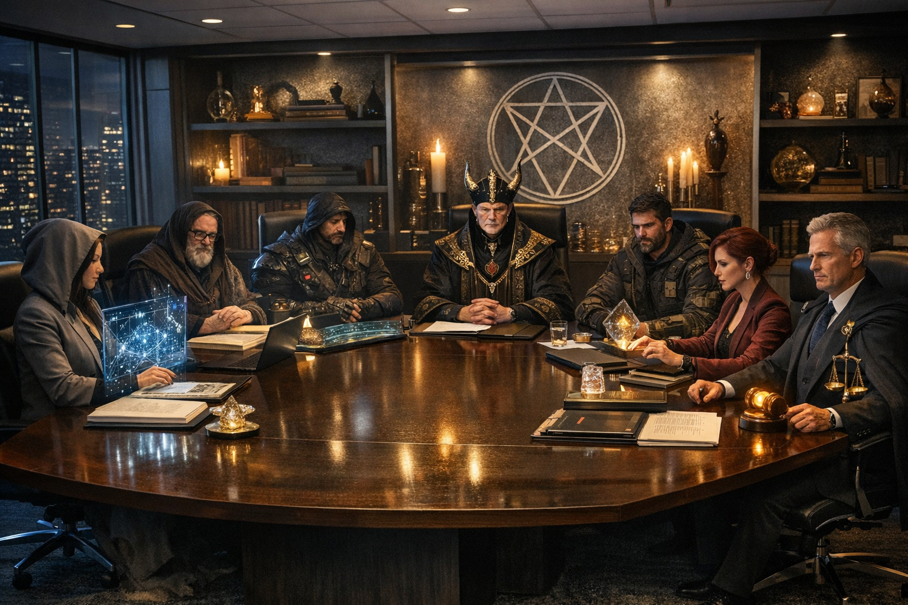

# Council of the Seven



**A Tiered Multi-Agent Governance Framework for Structured Software Development**

> *"In complex systems, order is not optional — it is structural necessity."*

A hierarchical multi-agent governance framework for VS Code Copilot that structures complex software development workflows through clearly separated domains of authority, constitutional boundaries, and enforced quality arbitration.

> Built upon [Github-Copilot-Atlas]([../Github-Copilot-Atlas](https://github.com/bigguy345/Github-Copilot-Atlas) with strengthened governance, stricter efficiency enforcement, and constitutional tier authorities.

> **Note:** Best supported on VS Code Insiders (as of January 2026) for access to the latest agent orchestration features.

---

## Overview

The Council of the Seven addresses the challenges of monolithic execution models by introducing:

- **Tiered Authority** - Seven specialized tiers with exclusive domains
- **Domain Specialization** - Each tier optimizes for depth, not breadth
- **Sequential Governance** - Work progresses through defined tiers; no bypassing
- **Constitutional Limits** - Hard boundaries prevent domain interference
- **Enforced Arbitration** - Independent quality gate with final verdict authority

**The Result:** Context consumption reduced from 80-90% (monolithic) to 10-15% (delegated), leaving 70-80% more tokens for deeper analysis, better reasoning, and faster iterations.

---

## The Seven Tiers

### Tier I — Command
**THE GRANDMASTER** (`Grandmaster.agent.md`)
- **Model:** Claude Sonnet 4.5 (copilot)
- **Domain:** Mission Authority & Orchestration
- **Responsibilities:**
  - Define objectives and success criteria
  - Establish project constraints
  - Orchestrate  tier-to-tier workflow
  - Manage user approval gates
- **Constitutional Limits:**
  - Cannot implement code directly
  - Cannot design architecture directly
  - Cannot override Arbiter verdicts
  - Cannot skip tier progression

---

### Tier II — Strategy
**THE WEAVER** (`Weaver.agent.md`)
- **Model:** GPT-5.2 (copilot)
- **Domain:** Architecture & System Design Authority
- **Responsibilities:**
  - Translate mission into technical blueprint
  - Define module boundaries and interfaces
  - Specify structural constraints
  - Write implementation plans
- **Constitutional Limits:**
  - Can ONLY write plan files (`.md` in plan directory)
  - Cannot execute code or run commands
  - Cannot bypass research tiers (must consult Archivist/Pathbreaker for >2 files)
- **Handoff:** Automatically offers to hand off to Grandmaster for execution

---

### Tier III — Intelligence
**THE ARCHIVIST** (`Archivist-subagent.agent.md`)
- **Model:** GPT-5.2 (copilot)
- **Domain:** Research & Knowledge Extraction Authority
- **Responsibilities:**
  - Extract documentation and API contracts
  - Validate standards and best practices
  - Summarize external dependencies
  - Return constraint briefs
- **Constitutional Limits:**
  - Cannot write/modify code
  - Cannot write plans (Weaver's domain)
  - Cannot execute commands
  - MUST respect output budget (max 10 files, 5 bullets per section)

---

### Tier IV — Reconnaissance
**THE PATHBREAKER** (`Pathbreaker-subagent.agent.md`)
- **Model:** Gemini 3 Flash (Preview) (copilot)
- **Domain:** Terrain Mapping & Codebase Exploration Authority
- **Responsibilities:**
  - Analyze existing code (read-only)
  - Map dependencies and file structures
  - Identify refactor risks
  - Detect hidden complexity
- **Constitutional Limits:**
  - Read-only; cannot edit files or run commands
  - No web research (fetch/github tools blocked)
  - MANDATORY parallel search strategy (3-10 simultaneous searches)
  - MUST respect output budget (max 15 files, 5 bullets per section)

---

### Tier V — Execution
**THE CONSTRUCT** (`Construct-subagent.agent.md`)
- **Model:** Claude Sonnet 4.5 (copilot)
- **Domain:** Implementation Authority (Backend/Core Logic)
- **Responsibilities:**
  - Write code according to Weaver's blueprint
  - Follow Archivist's constraints
  - Respect Pathbreaker's terrain findings
  - Implement tests (TDD: tests-first)
- **Constitutional Limits:**
  - Cannot redesign architecture (Weaver's domain)
  - Cannot introduce undocumented patterns
  - Cannot skip TDD workflow (tests-first is mandatory)
  - MUST respect output budget (max 5 bullets per section in completion report)

---

### Tier VI — Refinement
**THE ARTISAN** (`Artisan-subagent.agent.md`)
- **Model:** Gemini 3 Pro (Preview) (copilot)
- **Domain:** UX/UI & Presentation Authority
- **Responsibilities:**
  - Improve usability and accessibility
  - Ensure visual consistency
  - Refine interaction flow
  - Optimize frontend performance
- **Constitutional Limits:**
  - Cannot restructure logic or architecture (Construct/Weaver's domain)
  - Cannot skip TDD for frontend (component tests first)
  - MUST respect output budget (max 5 bullets per section in completion report)

---

### Tier VII — Arbitration
**THE ARBITER** (`Arbiter-subagent.agent.md`)
- **Model:** GPT-5.2 (copilot)
- **Domain:** Final Quality Gate & Acceptance Authority
- **Responsibilities:**
  - Enforce architectural alignment
  - Validate test coverage and correctness
  - Assess security posture and performance
  - Approve or reject work with tier-specific routing
- **Constitutional Authority:**
  - **Verdict is FINAL and INDEPENDENT**
  - Lower tiers cannot override Arbiter decisions
  - Can route rejections back to appropriate tier:
    - Architecture issues → Weaver (Tier II)
    - Implementation issues → Construct/Artisan (Tier V/VI)
    - Missing context → Archivist/Pathbreaker (Tier III/IV)
- **Constitutional Limits:**
  - Cannot implement fixes (Construct/Artisan's domain)
  - Cannot redesign (Weaver's domain)
  - MUST respect output budget (max 10 issues, 5 recommendations)

---

## Operational Workflow

The Council operates in a linear, feedback-enabled progression:

```
1. Grandmaster defines mission + constraints
   ↓
2. Weaver produces architecture blueprint (optional; Grandmaster may plan directly)
   ↓
3. Archivist validates knowledge + constraints (if needed)
   ↓
4. Pathbreaker maps terrain (MANDATORY if >3 files)
   ↓
5. Construct implements (backend/logic)
   OR
   Artisan refines (UI/UX)
   ↓
6. Arbiter reviews and renders verdict
   ↓
7a. If APPROVED → Grandmaster presents for commit
7b. If NEEDS_REVISION → Return to appropriate tier (Arbiter specifies)
7c. If FAILED → Stop and consult user (mission scope issue)
```

**Constitutional Rule:** No tier may be skipped. Lateral bypassing is disallowed.

---

## Governance Model

### Authority Hierarchy
- **Grandmaster initiates mission** (Tier I)
- **Arbiter controls acceptance** (Tier VII)
- **Architecture authority (Weaver) cannot be bypassed by execution (Construct/Artisan)**

This creates a balanced power structure, preventing centralized instability.

### Domain Non-Interference Rules
- Construct cannot redesign architecture
- Artisan cannot restructure logic
- Grandmaster cannot override architecture or arbitration
- Weaver cannot bypass research tiers
- No tier may exceed its mandated output budget

---

## Context Efficiency: The Core Promise

**Problem:** Traditional single-agent approaches exhaust precious tokens on context that could be used for your actual code.

**Solution:** By enforcing strict delegation + compressed handoff formats:

| Aspect | Monolithic Agent | Council of the Seven |
|--------|------------------|----------------------|
| Context consumption | 80-90% | 10-15% |
| Tokens for reasoning | 10-20% | 70-80% |
| Delegation triggers | Vague ("should") | Hard rules (MUST at >3 files) |
| Output formats | Unstructured | Budget-enforced (<10 files, <5 bullets) |
| Parallel execution | Encouraged | Mandatory (Pathbreaker: 3-10 searches) |
| Quality arbitration | Ad-hoc | Constitutional (Arbiter is final) |

**Efficiency Enforcement Mechanisms:**
1. **Tightened delegation triggers:**
   - >3 files → MUST delegate to Pathbreaker
   - >500 tokens → MUST delegate to Archivist
2. **Mandatory parallel execution:**
   - Pathbreaker: 3-10 simultaneous searches (hard requirement)
   - Archivist: Parallel invocation for multi-subsystem tasks
3. **Output budgets (constitutional):**
   - Archivist: max 10 files, 5 bullets per section
   - Pathbreaker: max 15 files, 5 bullets per section
   - Construct/Artisan: max 5 bullets per section
   - Arbiter: max 10 issues, 5 recommendations
4. **Constitutional boundaries:**
   - Each tier strictly constrained to its domain
   - Prevents sprawling context accumulation

---

## Installation

### Option 1: Automated Install (Windows)

```powershell
# Clone the repository
git clone https://github.com/bigguy345/Copilot-Agent-Suite.git
cd Copilot-Agent-Suite/Github-Copilot-CoS

# Install Council agents
.\install-cos-agents.ps1

# Or install to VS Code Insiders
.\install-cos-agents.ps1 -Insiders
```

### Option 2: Manual Install (All Platforms)

1. **Clone or download this repository:**
   ```bash
   git clone https://github.com/bigguy345/Copilot-Agent-Suite.git
   ```

2. **Copy agent files to VS Code User prompts directory:**
   - **Windows:** `%APPDATA%\Code\User\prompts\`
   - **macOS:** `~/Library/Application Support/Code/User/prompts/`
   - **Linux:** `~/.config/Code/User/prompts/`

   Copy these files: `Grandmaster.agent.md`, `Weaver.agent.md`, `Archivist-subagent.agent.md`, `Pathbreaker-subagent.agent.md`, `Construct-subagent.agent.md`, `Artisan-subagent.agent.md`, `Arbiter-subagent.agent.md`

3. **Reload VS Code** to recognize the Council

---

## Usage

### Planning with Weaver (Tier II - Strategy)

```
@Weaver design a comprehensive architecture for adding user authentication
```

Weaver will:
1. Invoke Pathbreaker (>3 files) to map the codebase
2. Invoke Archivist (parallel if multi-subsystem) for research
3. Write a detailed TDD plan with architectural blueprint
4. Offer to hand off to Grandmaster for execution

### Executing with Grandmaster (Tier I - Command)

```
@Grandmaster implement the plan
```

OR: Accept the handoff from Weaver by clicking the handoff button

Grandmaster will:
1. Review the plan and constraints
2. Delegate Phase 1 implementation to Construct (Tier V) or Artisan (Tier VI)
3. Delegate review to Arbiter (Tier VII)
4. Analyze Arbiter's verdict:
   - APPROVED → Present for commit
   - NEEDS_REVISION → Route to appropriate tier per Arbiter's guidance
   - FAILED → Consult user for mission guidance
5. Continue through all phases with tier-enforced progression

### Research with Archivist (Tier III - Intelligence)

```
@Archivist research how the authentication layer is structured
```

Archivist will:
- Extract API contracts and patterns
- Identify constraints and dependencies
- Return structured findings (output budget: max 10 files, 5 bullets per section)

### Direct Exploration with Pathbreaker (Tier IV - Reconnaissance)

```
@Pathbreaker find all usages of the UserAuth class
```

Pathbreaker will:
- Launch 3-10 parallel searches (mandatory)
- Map dependencies and file structures
- Return compact, high-signal results (max 15 files)

---

## Key Features

### ✅ Constitutional Governance
- Each tier has exclusive domain authority
- No domain overlap without formal handoff
- Hard boundaries prevent architectural drift

### 🔒 Sequential Tier Progression
- Work flows through defined tiers
- Lateral bypassing is disallowed
- Arbiter can route rejections to appropriate tier

### 📊 Context Efficiency (80-90% → 10-15%)
- MANDATORY delegation at >3 files (not >5 or >10)
- MANDATORY parallel execution (Pathbreaker: 3-10 searches)
- Output budgets prevent context re-inflation
- Constitutional boundaries enforce specialization

### 🧪 Test-Driven Development
- Every phase follows red-green-refactor cycle
- Tests written first, run to fail, then minimal code
- Mandatory for both Construct and Artisan

### ⚖️ Independent Arbitration
- Arbiter (Tier VII) provides final, binding verdict
- Lower tiers cannot override Arbiter decisions
- Arbiter routes rejections to appropriate tier for remediation

---

## Comparison: Council vs Standard Suite

| Feature | Standard Copilot-Agent-Suite | Council of the Seven |
|---------|------------------------------|----------------------|
| **Governance Model** | Role-based delegation | Constitutional tiers with hard boundaries |
| **Delegation Triggers** | >5 files, >1000 tokens | >3 files, >500 tokens (tighter) |
| **Parallel Execution** | Encouraged | Mandatory (Pathbreaker: 3-10 searches) |
| **Output Budgets** | Encouraged | Constitutionally enforced (max files/bullets) |
| **Arbitration** | Review agent suggests changes | Arbiter has final independent verdict + tier routing |
| **Tier Bypassing** | Allowed with guidance | Constitutionally prohibited |
| **Domain Interference** | Discouraged | Constitutionally prohibited |

---

## Example Workflow

**User:** @Grandmaster add a user dashboard feature with charts

**Grandmaster (Tier I):**
1. Defines mission: "Add user dashboard with interactive charts"
2. Identifies: frontend UI work (Artisan) + data fetching (Construct)
3. Invokes Pathbreaker (>3 files): "Find existing dashboard patterns"

**Pathbreaker (Tier IV):**
- Launches 5 parallel searches
- Maps 12 relevant files
- Returns compact terrain analysis (15 file max)

**Grandmaster:**
4. Invokes Archivist: "Research charting libraries and data patterns"

**Archivist (Tier III):**
- Extracts API contracts for data endpoints
- Identifies Chart.js as existing library
- Returns structured brief (10 files, 5 bullets per section)

**Grandmaster:**
5. Writes plan OR invokes Weaver to design architecture
6. Delegates Phase 1 to Construct (backend data endpoints)

**Construct (Tier V):**
- Writes tests first (TDD)
- Implements minimal data endpoint code
- Returns structured completion report (5 bullets per section)

**Grandmaster:**
7. Invokes Arbiter for review

**Arbiter (Tier VII):**
- Reviews implementation
- Validates architectural alignment
- **Verdict: APPROVED**

**Grandmaster:**
8. Presents Phase 1 completion + commit message to user
9. User commits
10. Grandmaster proceeds to Phase 2 (frontend charts with Artisan)

---

## Advanced: Project-Specific Configuration

### Plan Directory
Create `AGENTS.md` in your project root:

```markdown
# Agent Configuration

**Plan Directory:** `.council/plans`
```

The Council will use `.council/plans` instead of `plans/` for all plan documents.

### Custom Arbiter Checklists
When invoking Arbiter, Grandmaster can provide project-specific quality checklists:

```
@Grandmaster implement the plan

[When invoking Arbiter, Grandmaster includes:]
**Project-Specific Checklist:**
- Verify all API endpoints follow RESTful conventions
- Ensure database migrations are reversible
- Check that Error responses include request IDs
```

---

## Advantages

### ✅ Reduced Context Overload
Each tier focuses only on relevant domain information. Constitutional boundaries + output budgets prevent context re-inflation.

### ✅ Improved Architectural Stability
Structural authority is centralized in Weaver (Tier II). Lower tiers cannot redesign architecture.

### ✅ Enhanced Accountability
Clear responsibility boundaries eliminate ambiguity. Arbiter's final verdict removes quality gate confusion.

### ✅ Scalable Collaboration
The framework can apply to:
- Human teams (governance model)
- AI agents (prompt-based orchestration)
- Hybrid systems (human-in-the-loop with AI execution)

---

## Limitations & Mitigation

| Risk | Mitigation |
|------|------------|
| Over-formalization may slow iteration | Allow Grandmaster to batch "small fixes" into single Council cycle |
| Output budgets might omit key details | Allow Arbiter to request "expanded brief" from Archivist only when critical |
| Confusion between Council vs standard suite | Keep in separate folders with distinct installers |

---

## Conceptual Foundation

The Council of the Seven is inspired by:
- **Multi-agent orchestration** (Github-Copilot-Atlas, copilot-orchestra)
- **Constitutional governance** (separation of powers, explicit authority boundaries)
- **Context efficiency research** (80-90% → 10-15% through delegation + compression)
- **Test-Driven Development** (red-green-refactor as constitutional requirement)

It represents a progression from single-agent execution toward **deliberate, governed orchestration**.

---

## License

MIT License

Copyright (c) 2026 Council of the Seven Contributors

Permission is hereby granted, free of charge, to any person obtaining a copy of this software and associated documentation files (the "Software"), to deal in the Software without restriction, including without limitation the rights to use, copy, modify, merge, publish, distribute, sublicense, and/or sell copies of the Software, and to permit persons to whom the Software is furnished to do so, subject to the following conditions:

The above copyright notice and this permission notice shall be included in all copies or substantial portions of the Software.

THE SOFTWARE IS PROVIDED "AS IS", WITHOUT WARRANTY OF ANY KIND, EXPRESS OR IMPLIED, INCLUDING BUT NOT LIMITED TO THE WARRANTIES OF MERCHANTABILITY, FITNESS FOR A PARTICULAR PURPOSE AND NONINFRINGEMENT. IN NO EVENT SHALL THE AUTHORS OR COPYRIGHT HOLDERS BE LIABLE FOR ANY CLAIM, DAMAGES OR OTHER LIABILITY, WHETHER IN AN ACTION OF CONTRACT, TORT OR OTHERWISE, ARISING FROM, OUT OF OR IN CONNECTION WITH THE SOFTWARE OR THE USE OR OTHER DEALINGS IN THE SOFTWARE.

---

## Contributing

We welcome contributions that:
- Strengthen constitutional governance
- Improve context efficiency enforcement
- Add project-specific integrations
- Enhance documentation

---

## Acknowledgments

Built upon the foundation of:
- [copilot-orchestra](https://github.com/ShepAlderson/copilot-orchestra) by ShepAlderson
- [oh-my-opencode](https://github.com/code-yeongyu/oh-my-opencode) by code-yeongyu
- The Copilot-Agent-Suite (role-based naming) by bigguy345

---

**Note:** The Council of the Seven is designed for complex, multi-phase development work where architectural integrity and context efficiency are paramount. For simpler tasks, the standard tCopilot-Agent-Suite may be more appropriate. Choose the governance model that fits your project's complexity.

> *"In complex systems, order is not optional — it is structural necessity."*
